# Gestión de Ventas de Zapatería

## Descripción

El sistema que se ha presentado se basa en la gestión de ventas de una zapatería mostrándonos una conexión entre los diferentes controladores, la sección de vista y su modelo a una base de datos que contiene las especificaciones del sistema.

De la siguiente forma, debemos entender que el sistema nos proporciona un inicio de sesión para identificarnos ya sea como un empleado de tipo cajero o como gerente, mostrando una visualización diferente según el puesto, ya que estos dos roles tienen funciones diferentes.

El sistema presentado tiene diversas funciones, las cuales incluyen:

- **Inicio de Sesión**: Identifica a los tipos de empleados.
  - **Cajero**: Un empleado cuya función principal es vender productos, revisar el inventario para saber si hay existencias, realizar un corte de caja para conocer las ventas del día, hacer devoluciones si es necesario y visualizar los proveedores en caso de necesitar contactar con ellos.
  - **Administrador**: Maneja los proveedores y empleados dentro de la base de datos, pudiendo agregar o eliminar empleados. En la pantalla principal del administrador, se puede visualizar a los empleados de la empresa y se pueden realizar funciones específicas como:
    - Visualizar el inventario para agregar nuevos productos o visualizar los datos de un proveedor.
    - Ver las credenciales de un empleado seleccionado, agregarlo como cajero para que tenga su propio inicio de sesión, modificar los datos del empleado o eliminarlo.

Recordemos que la función principal en la venta de algún producto requiere un sistema que venda y muestre lo vendido, por lo que se necesita un comprobante de venta. En caso de que el cliente lo requiera, el ticket puede ser enviado al correo electrónico proporcionado.

Todo sistema requiere una validación de inicio de sesión para los distintos empleados, por lo que en caso de perder u olvidar la contraseña, esta debe ser enviada al correo privado del empleado para que quede registrada y pueda ser recuperada en caso de error.

## Usos

Los usos de este sistema son específicos y concretos, ya que se ha definido directamente para una empresa de zapatería. Por el momento, su uso en distintos campos o su implementación en otra empresa puede verse afectado, requiriendo ciertas actualizaciones o modificaciones para garantizar la compatibilidad total del sistema con los requerimientos de una nueva empresa.
## Características y Funciones - 
**Gestión de Usuarios (CRUD)**: Crear, leer, actualizar y eliminar usuarios. - 
**Gestión de Productos (CRUD)**: Crear, leer, actualizar y eliminar productos. - 
**Conexión a Base de Datos**: Integración con una base de datos para almacenamiento y recuperación de datos. - 
**Generación de PDF**: Crear documentos PDF con información relevante. - 
**Envío de PDF a Correo Electrónico**: Enviar documentos PDF generados al correo electrónico del cliente.

|

## API del Sistema

| Componente              | Descripción                                                                                          |
|-------------------------|------------------------------------------------------------------------------------------------------|
| `JTabbedPane`           | Proporciona una interfaz de usuario con pestañas, donde cada pestaña puede contener un panel diferente con sus propios componentes. |
| `JPanel1`               | Muestra el inicio de sesión de un administrador.                                                      |
| `JPanel2`               | Muestra el inicio de sesión de un cajero.                                                             |
| `JTextField`            | Permite al usuario ingresar una sola línea de texto.                                                  |
| `JLabel`                | Introduce textos para identificar componentes.                                                        |
| `JPasswordField`        | El texto ingresado se muestra como caracteres de ocultación (por ejemplo, asteriscos '*').            |
| `JButton (Entrar)`      | Botón para realizar la acción de entrar a una cuenta.                                                 |
| `JButton (Salir)`       | Botón asociado a la función de cerrar la conexión con la base de datos.                               |
| `JCheckBox`             | Cambia el estado de los caracteres asociados al `JPasswordField` de contraseña.                       |
| `JButton (Recuperar Contraseña)` | Contiene un método que nos devuelve la contraseña almacenada en la base de datos.                    |
| `JLabel` (Logo)         | Usado como etiqueta para tener el logo de la empresa.                                                 |
| `btnCancelar (Exit)`    | Botón aplicado en las ventanas con el fin de salir de las ventanas y terminar las acciones del sistema. |
| `JPanel (Caja)`         | Ofrece la vista de cómo se generarán las ventas.                                                      |
| `JLabel` (Componentes)  | Etiquetas que nos muestran los nombres de los componentes.                                            |
| `JTextField` (Datos)    | Al introducir texto se guardará para evaluar métodos establecidos con esos datos.                     |
| `JScrollPane`           | Añade automáticamente barras de desplazamiento verticales y horizontales cuando el contenido excede el área visible. |
| `JTable`                | Agrega una tabla donde podremos visualizar datos de acuerdo a las consultas que se hagan a la base de datos. |
| `JButton (Añadir)`      | Botón con la función de agregar los datos guardados en los `JTextField`.                              |
| `JButton (Eliminar)`    | Botón con la función contraria del botón agregar, elimina algún producto ya agregado.                 |
| `JButton (Generar Venta)` | Botón con el método de darnos una vista de la venta que se ha generado, además de enviar el PDF del ticket a un correo. |
| `JDateChooser`          | Proporciona una interfaz visual que permite al usuario seleccionar una fecha desde un calendario desplegable. |
| `JMonthChooser`         | Permite seleccionar un mes específico.                                                               |
| `JYearChooser`          | Permite verificar un año en específico.                                                              |
| `JComboBox`             | Permite al usuario seleccionar una opción de una lista desplegable.                                  |
## Metodos

| **Método** | **Propósito** |
|------------|---------------|
| `getInstance()` | Implementa el patrón Singleton para asegurar que solo una instancia de la clase `Conexion` sea creada. |
| `getConnection()` | Devuelve la conexión actual a la base de datos. |
| `reconnect()` | Cierra la conexión actual y la vuelve a abrir para reestablecer la conexión a la base de datos. |
| `close()` | Cierra la conexión a la base de datos si está abierta. |
| `insertarAdministrador()` | Inserta un nuevo administrador en la base de datos. |
| `actualizarAdministrador()` | Actualiza la información de un administrador existente. |
| `eliminarAdministrador()` | Elimina un administrador de la base de datos. |
| `obtenerAdministradores()` | Obtiene todos los administradores de la base de datos. |
| `buscarAdministradorPorID()` | Busca un administrador por su ID. |
| `insertarCajero()` | Inserta un nuevo cajero en la base de datos para agregarlo a la tabla `cajeros`. |
| `actualizarCajero()` | Actualiza la información de un cajero existente en la tabla `cajeros`. |
| `eliminarCajero()` | Elimina un cajero de la base de datos y lo quita de la tabla `cajeros`. |
| `obtenerCajeros()` | Obtiene todos los cajeros de la base de datos y recupera todos los registros de la tabla `cajeros`. |
| `buscarCajeroPorID()` | Busca un cajero específico por su ID en la tabla `cajeros`. |
| `actualizarCliente()` | Actualiza la información de un cliente existente en la tabla `cliente`. |
| `eliminarCliente()` | Elimina un cliente de la base de datos y lo quita de la tabla `cliente`. |
| `obtenerClientes()` | Obtiene todos los clientes de la base de datos y recupera todos los registros de la tabla `cliente`. |
| `buscarClientePorID()` | Busca un cliente específico por su ID en la tabla `cliente`. |
| `insertarDevolucion()` | Inserta una nueva devolución en la base de datos para agregarla a la tabla `devoluciones`. |
| `actualizarDevolucion()` | Actualiza la información de una devolución existente en la tabla `devoluciones`. |
| `eliminarDevolucion()` | Elimina una devolución de la base de datos y la quita de la tabla `devoluciones`. |
| `EntrarActionPerformed()` | Combina las verificaciones de correo y contraseña en una sola consulta SQL y gestiona la conexión de manera más eficiente. |
| `SalirActionPerformed()` | Maneja la acción de salir de la aplicación. |
| `validarIdCajero()` | Define una consulta SQL para contar los registros en la tabla `Cajeros` con el ID especificado. |
| `consultar()` | Consulta y muestra datos de la tabla `Zapato`. |
| `actualizarCampos()` | Actualiza los campos de texto con datos del zapato seleccionado por su ID de estilo. |
| `actualizarStock()` | Actualiza el stock de un zapato específico por modelo. |
| `devolverStock()` | Devuelve una cantidad específica de stock de un zapato por modelo. |
| `actualizarTotalPagar()` | Calcula el total a pagar sumando los valores de una columna específica en la tabla y lo muestra en un campo de texto. |
| `generarNotaDeVenta()` | Genera una nota de venta con los datos de la tabla, incluyendo fecha, email del cajero y detalles de los productos. |
| `generarPDF()` | Genera un archivo PDF con el contenido proporcionado. |
| `generarNombreUnico()` | Genera un nombre de archivo único añadiendo un contador al nombre base. |
| `enviarCorreo()` | Envía un correo electrónico con el archivo PDF adjunto. |
| `guardarNotaEnArchivo()` | Guarda una nota en un archivo de texto. |
| `insertarTransaccion()` | Inserta una transacción en la base de datos y retorna el ID generado. |
| `obtenerEmailCajero()` | Obtiene el correo electrónico de un cajero dado su ID. |
| `realizarCorteCaja()` | Realiza un corte de caja para una fecha específica, sumando las transacciones por forma de pago. |
| `cargarTransaccionesEnTabla()` | Carga las transacciones en una tabla desde la base de datos. |
| `realizarCorteCaja1()` | Similar al método `realizarCorteCaja`, con reconexión a la base de datos si es necesario. |
| `getNextTransactionId()` | Obtiene el próximo ID de transacción disponible. |
| `realizarDevolucion()` | Realiza una devolución de una transacción específica. |
| `verificarInventario()` | Verifica el inventario de zapatos y revisa sus cantidades. |
| `enviarAlerta()` | Envía una alerta de inventario bajo y ofrece reabastecer el producto. |
| `iniciarMonitoreoInventario()` | Inicia un monitoreo periódico del inventario cada minuto. |
| `generarReporteZapatosVendidos()` | Genera un reporte de los zapatos vendidos, ordenado por la cantidad vendida. |
| `reabastecerProducto()` | Reabastece el stock de un producto específico. |
| `cargarTransaccionesEnTablaPorFecha()` | Carga las transacciones en una tabla filtrando por fecha. |
| `buscarModelosMasVendidos()` | Busca los modelos más vendidos en un mes y año específicos. |
| `Verificar Selección()` | Comprueba si hay un empleado seleccionado en la tabla. |
| `Obtener Datos del Empleado()` | Recopila los datos del empleado seleccionado. |
| `Consultar Datos Adicionales()` | Realiza una consulta SQL para obtener información adicional (correo, salario, puesto) usando el RFC del empleado. |

## Diagrama Entidad-Relacional
A continuación, se muestra el diagrama entidad-relacional que ilustra las tablas y relaciones del sistema:
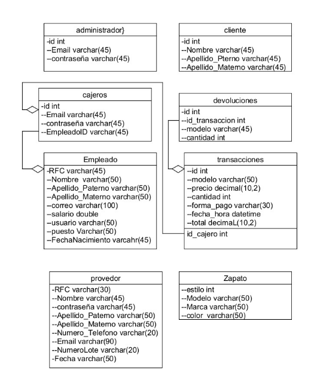 

### Tablas y Relaciones

#### Tabla: Empleados
| Columna             | Tipo            |
|---------------------|-----------------|
| RFC                 | VARCHAR(30)     |
| nombre              | VARCHAR(50)     |
| Apellido_Paterno    | VARCHAR(50)     |
| Apellido_materno    | VARCHAR(50)     |
| correo              | VARCHAR(100)    |
| salario             | DOUBLE          |
| Usuario             | VARCHAR(50)     |
| Puesto              | VARCHAR(50)     |
| FechaNacimiento     | VARCHAR(45)     |

#### Tabla: Zapato
| Columna             | Tipo            |
|---------------------|-----------------|
| Estilo              | INT PRIMARY KEY |
| Modelo              | VARCHAR(50)     |
| Marca               | VARCHAR(50)     |
| Color               | VARCHAR(50)     |
| Talla               | DOUBLE          |
| Cantidad            | INT             |
| precio              | DOUBLE          |
| Tipo                | VARCHAR(100)    |

#### Tabla: Cajeros
| Columna             | Tipo            |
|---------------------|-----------------|
| ID                  | INT PRIMARY KEY |
| Email               | VARCHAR(45)     |
| Contrasena          | VARCHAR(45)     |
| EmpleadoID          | VARCHAR(45)     |

#### Tabla: Administrador
| Columna             | Tipo            |
|---------------------|-----------------|
| ID                  | INT PRIMARY KEY |
| Email               | VARCHAR(45)     |
| Contrasena          | VARCHAR(45)     |

#### Tabla: Cliente
| Columna             | Tipo            |
|---------------------|-----------------|
| ID                  | INT PRIMARY KEY |
| nombre              | VARCHAR(50)     |
| Apellido_Paterno    | VARCHAR(50)     |
| Apellido_materno    | VARCHAR(50)     |
| Numero_Telefono     | VARCHAR(100)    |

#### Tabla: Devoluciones
| Columna             | Tipo            |
|---------------------|-----------------|
| id                  | INT PRIMARY KEY |
| id_transaccion      | INT             |
| modelo              | VARCHAR(250)    |
| Cantidad            | INT             |
| precio              | DOUBLE          |
| fecha_hora          | TIMESTAMP       |

#### Tabla: Proveedor
| Columna             | Tipo            |
|---------------------|-----------------|
| RFC                 | VARCHAR(30)     |
| Nombre              | VARCHAR(60)     |
| Apellido_Paterno    | VARCHAR(50)     |
| Apellido_materno    | VARCHAR(50)     |
| Numero_Telefono     | VARCHAR(20)     |
| Email               | VARCHAR(90)     |
| NumeroLote          | VARCHAR(20)     |
| Fecha               | VARCHAR(50)     |

### Funcionalidades Adicionales

| Funcionalidad                     | Descripción                                                                                 |
|-----------------------------------|---------------------------------------------------------------------------------------------|
| Administración de Empleados y Productos | Solo los empleados con tipo 'Administrador' pueden agregar nuevos empleados o productos. |
| Visualización del Inventario      | Todos los empleados pueden visualizar el inventario de productos (Zapato).                 |
| Vista del Corte de Caja           | Los empleados pueden ver el corte de caja, que muestra las ventas realizadas.              |

## uso.
1.- iniciar sesión como cajero o como administrador
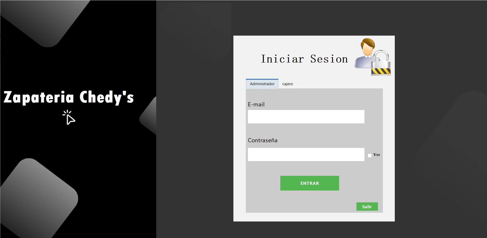 
2.- pantalla de inicio de un cajero, función de generar las ventas.
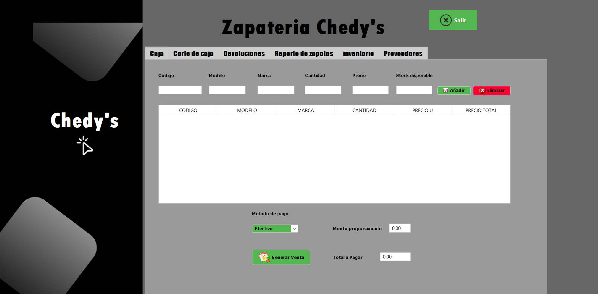 
3.- segundo panel de un cajero, donde se puede generar un corte de caja de las ventas
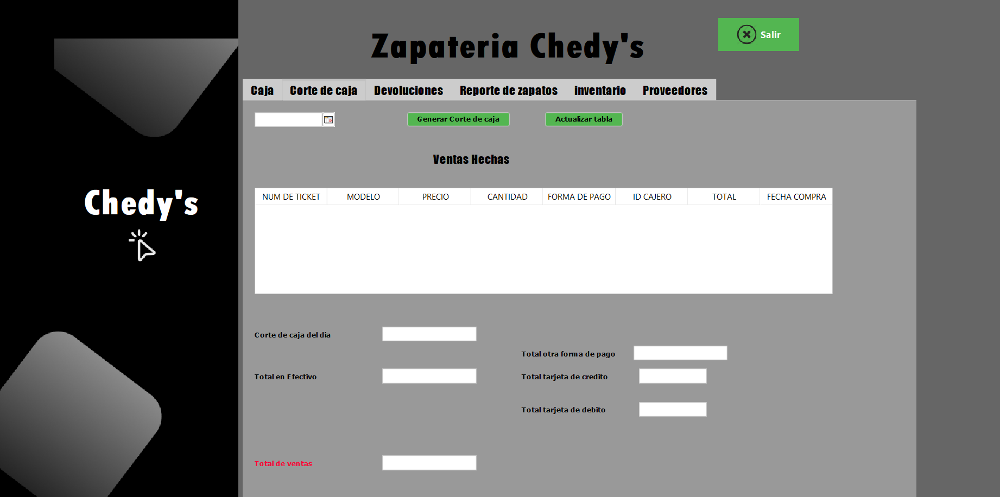 
4.-tercer panel nos muestra la opción de generar una devolución para que se vuelva a agregar el producto devuelto a la base de datos.
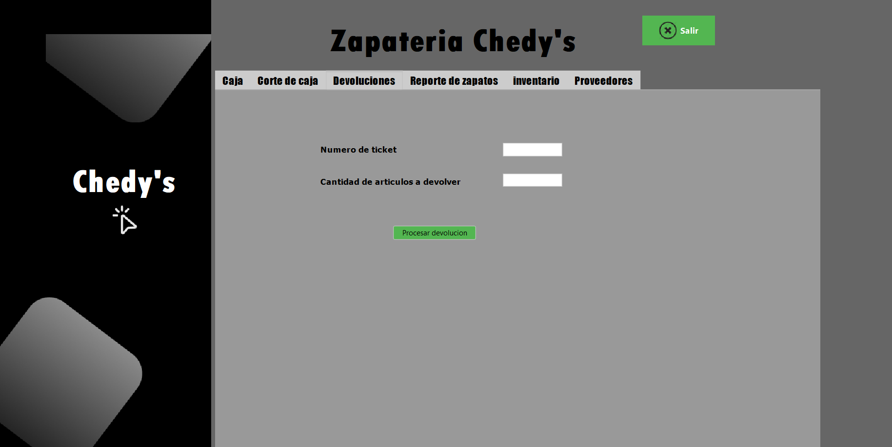 
5.- cierto panel nos da la opción de visualizar los productos vendidos en un periodo de tiempo que según sea solicitado 
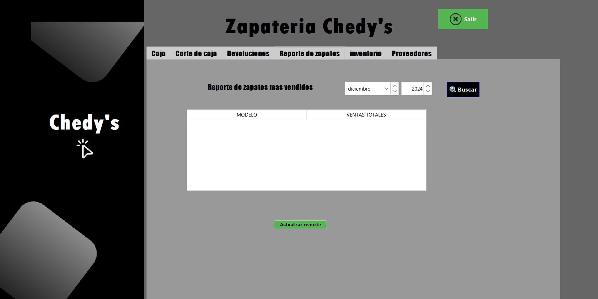 
6.- quinto panel se basa en el inventario por lo que podemos visualizar todos los productos, sus datos y características las cuales están almacenadas en la base de datos
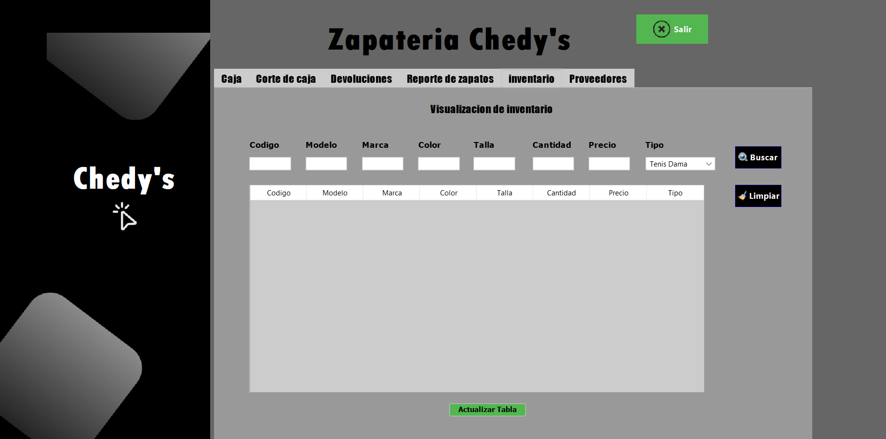 
7.- vista del inicio de session de un administrador y sus diversas funciones.
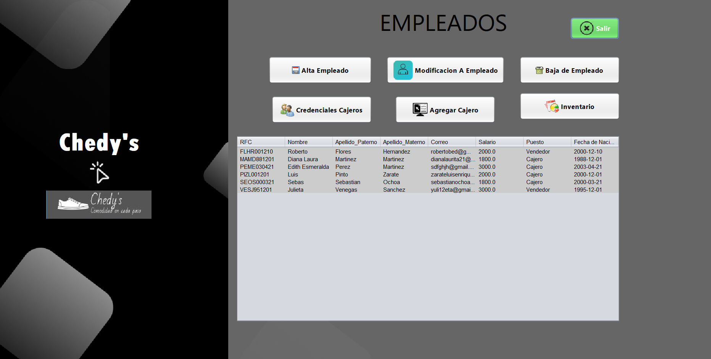 
8.- validacion de campos para dar de alta a un empleado nuevo 
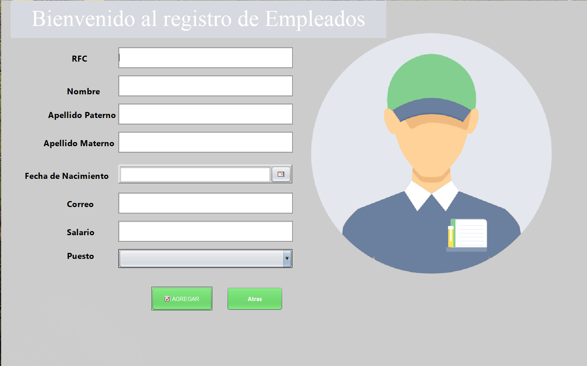 
9.- modificacion de los datos de un cliente existente
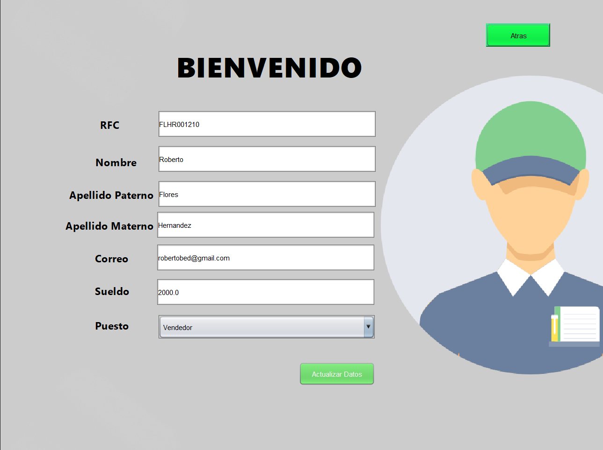 
10.- credenciales de un cajero por si se necesita modificar el inicio de un cajero o empleado
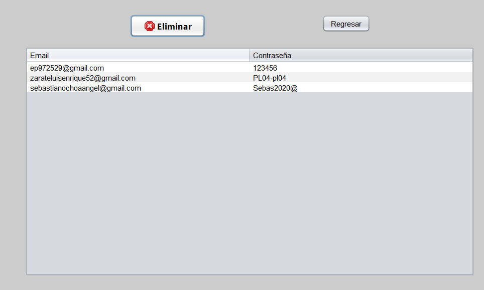 
11.- visualizacion del inventario que nos puede conducir a dar de alta un nuevo producto o eliminarlo de la base de datos por inexistencia en caso de que no se hayan recibido un nuevo lote en un determinado tiempo o cuando de cero.
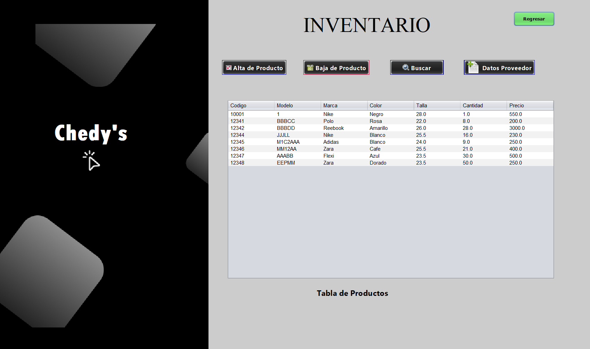 

## video demostrativo 
https://youtu.be/ijwb3YIN12o 

